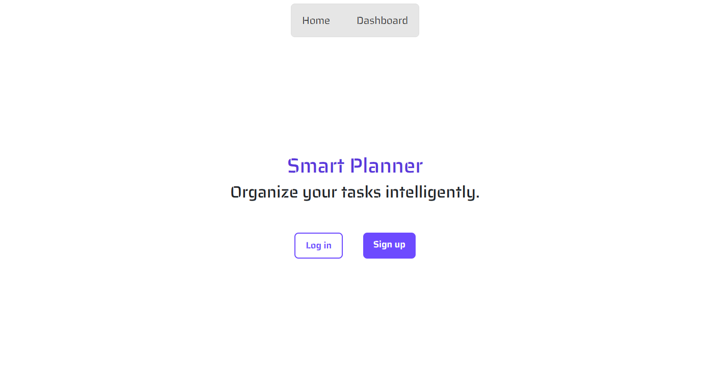
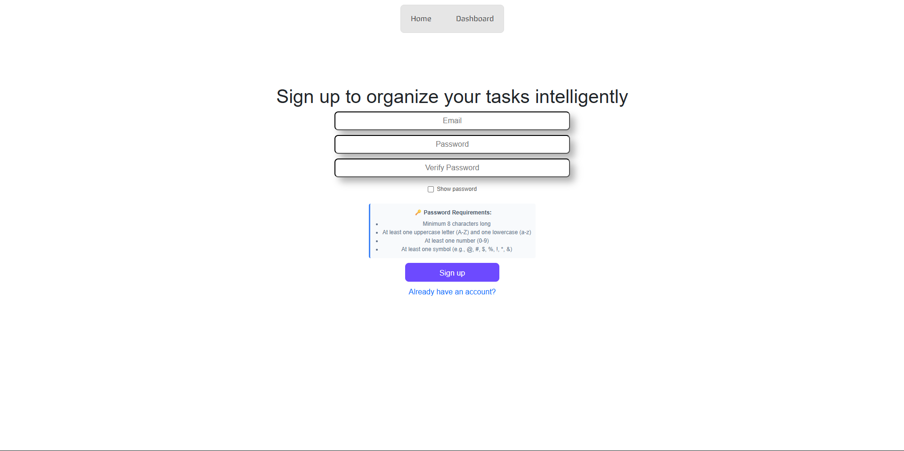
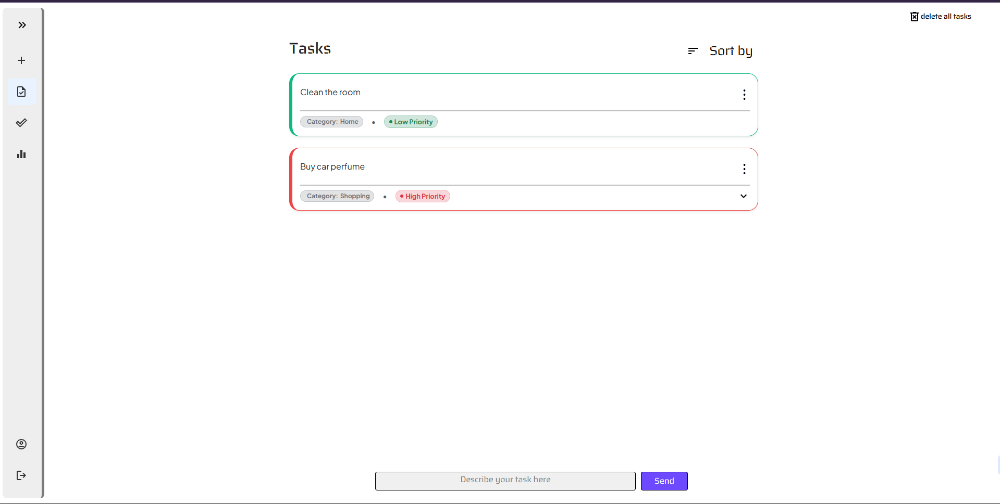
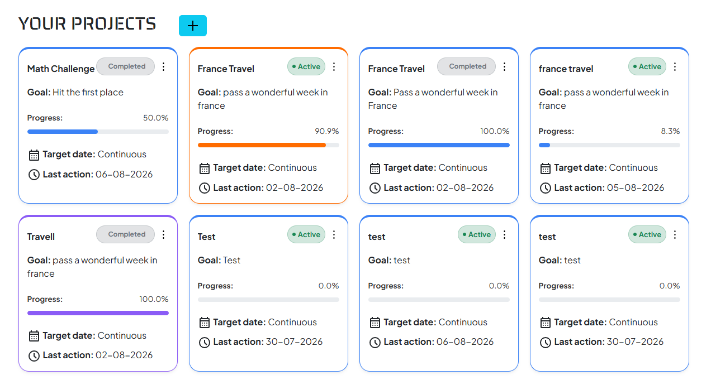
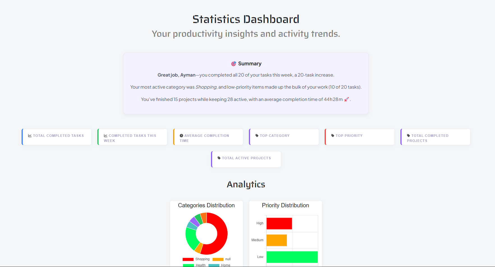

# Smart Planner
 An intelligent and responsive tasks management web application built with Flask and SQLite.  
 note: This project is for Horizons.

--------------

## Project evolution
v1 : Basic terminal application using interactive key prompts like (yes,no).  
v2 : command lines interface like git.   
v3 : Full web interface built with Flask, moving from CSV to SQLAlchemy & SQLite  
[You can see the project versions in the project tags](https://github.com/82936473/Horizons-AI/tags)

--------------

## Features

*   **Secure Auth:** sign-up, log in, log out, and protected personal tasks and projects dashboards
*   **Task Management:** Full crud operations : add, edit, complete, and delete tasks
*   **Smart Organization:** Assign task priorities, categories, and set due dates.
*   **Smart Categorization:** Automaticlly detects task categories
*   **Project Management:** Smart project management, (add, edit, delete), orginazed with milestones.
*   **Quick Add:** Quick add tasks easily by describing it, and generate full projects using AI.
*   **Weekly Summary:** Recieve an email every week contain the sammary of your progress and actions.
*   **Statistics:** Track your productivity with a clear visual analytics.
*   **Responsive Interface:** A clean, modern user interface optimized for desktop and mobile screens.

--------------

## How it works
In the first time trying the application, you should sign up by dropping your email, creating a password, and choose a name.  
You'll receive a greeting email and you'll have a personal account protected by password hashing.
After logging in, you can scroll between pages and manage your tasks, projects, and view statistics easily, plus using ai to to make that more easier and fast.

--------------

## Installation and Setup
Clone the repository:
```bash
git clone https://github.com/82936473/Horizons-AI.git
```
Install the requirements:
```bash
pip install -r requirements.txt
```
Create .env file and fill the variables
```bash
API_KEY = your_groq_api_key #the application use Groq, you can change that in the main.py file
RESET_DB = False #Put True if you want to clean the database everytime tou restart the application
SECRET_KEY = long_secret_key_for_flask_session_security
address_email = your_private_address_email
password_email = Mail_password
```
Run the Application:
```bash
python main.py
```
--------------

## Future improvements
* Multiple languages.
* Dark mode.
* ADD Date and time for tasks instead of Date only.

--------------
## Live Demo
[Check out the acual live website.](https://smartplanner.ayman.hackclub.app/)

--------------
## What I used AI for
The majority of the project was full human creating, from searching the idea to applying it.  
But AI Help was present in:
- learn how to use flask, css, and javascript in the first website version building steps.
- get help for resolving bugs.
- analyse API outputs.  


--------------

## Some screenshots for project improuvement (website version)
* ### Home:
|Before|After|
|---------|---------|
|||
* ### Sign up:
|Before|After|
|-----|-----|
|||
* ### Tasks Dashboard
|Before|After|
|--------|---------|
|||
* ### Added Features:
Projects:

Statistics:

--------------


## What I learned During This Project
During this project, I learned:

- Flask routing.
- HTML & CSS.
- SQLAlchemy and SQLite.
- User authentication.
- Password hashing.
- Responsive web design.
- Git and GitHub workflow.
- HTMX and background communication.